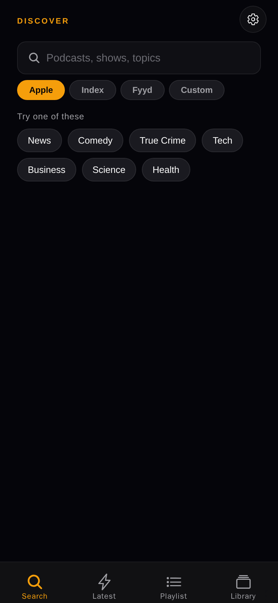
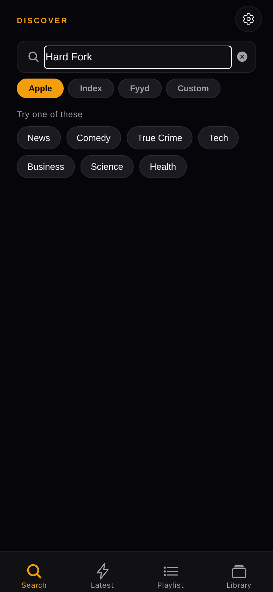
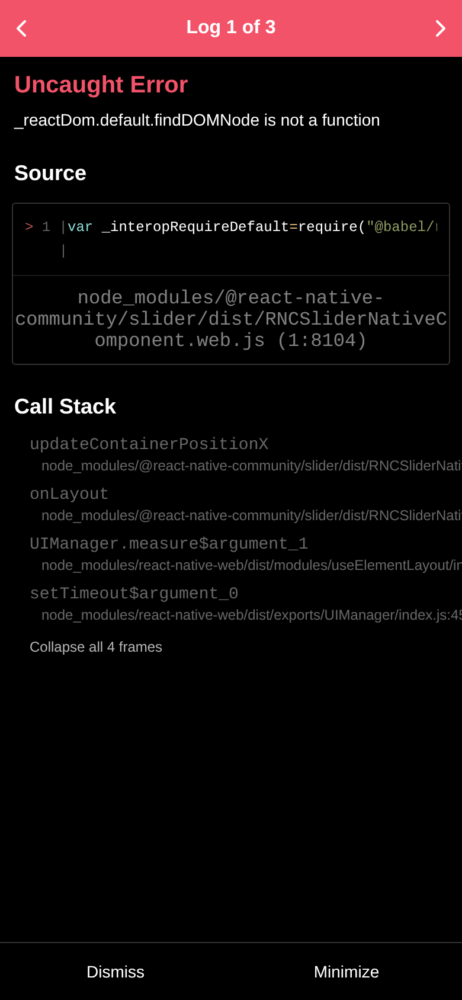

# PodPlayer — User Manual

A pocket-sized guide to your new podcast player. PodPlayer is a fully offline-capable podcatcher that lets you discover, subscribe, download, and listen to podcasts from multiple directories — without locking you into anyone's ecosystem.

  

---

## Table of contents

1. [Installing the app](#1-installing-the-app)
2. [The four tabs at a glance](#2-the-four-tabs-at-a-glance)
3. [Finding podcasts](#3-finding-podcasts)
4. [Subscribing](#4-subscribing)
5. [Listening to episodes](#5-listening-to-episodes)
6. [The player screen](#6-the-player-screen)
7. [Lock-screen, Bluetooth & notification controls](#7-lock-screen-bluetooth--notification-controls)
8. [Downloading for offline](#8-downloading-for-offline)
9. [The playlist (your queue)](#9-the-playlist-your-queue)
10. [Video podcasts](#10-video-podcasts)
11. [Auto-resume](#11-auto-resume)
12. [Sleep timer](#12-sleep-timer)
13. [OPML import / export](#13-opml-import--export)
14. [Settings reference](#14-settings-reference)
15. [Troubleshooting](#15-troubleshooting)

---

## 1. Installing the app

PodPlayer is distributed as an Android APK. There is currently no Google Play listing.

1. On your Android phone, allow installation from unknown sources for your browser or file manager (Settings → Security → Install unknown apps).
2. Tap the APK download link from your build email or copy the file from your computer.
3. Open the APK file → tap **Install**.
4. When you first launch PodPlayer, Android will ask whether to allow notifications. **Tap Allow** — this is required for the lock-screen player to work.

> 💡 To upgrade, install a newer APK over the existing one. Your subscriptions, downloads, played history and resume position are all preserved on upgrade.

---

## 2. The four tabs at a glance

PodPlayer has four tabs along the bottom of the screen:

| Icon | Tab | Purpose |
|---|---|---|
| 🔍 | **Search** | Discover new podcasts from Apple iTunes, Podcast Index, Fyyd, or your own custom JSON API. |
| ⏰ | **Latest** | A unified feed of the newest episodes from podcasts you're subscribed to, grouped by show. |
| 📋 | **Playlist** | Episodes you've downloaded and queued for offline listening. |
| 📚 | **Library** | All podcasts you're subscribed to. |

A small **mini-player** appears just above the tab bar whenever an episode is loaded — tap it to open the full player. There's also a **gear icon** in the top-right of every tab that opens **Settings**.

---

## 3. Finding podcasts

### Search a directory

1. Open the **Search** tab.
2. Beneath the search box you'll see a row of pills: **Apple / Index / Fyyd / Custom**. Pick the directory you want to query.
3. Type in the search box and tap **Go** (or wait — it auto-searches as you type).

  

| Directory | Best for |
|---|---|
| **Apple** | Mainstream podcasts. Default. No setup needed. |
| **Index** (podcastindex.org) | Indie shows, Podcasting 2.0 features, things Apple won't index. *Requires a free API key — see Settings.* |
| **Fyyd** | Smaller, community-curated index. No setup needed. |
| **Custom** | Power-user option for querying your own JSON search endpoint. *Requires URL template config — see Settings.* |

### Add a feed by URL

If a podcast doesn't show up in any directory (private, internal, or self-hosted), you can subscribe directly:

1. **Settings** (gear icon) → scroll to **Custom RSS Feed**.
2. Paste the RSS feed URL (e.g. `https://example.com/feed.xml`).
3. Tap **Subscribe**. The app will fetch the feed, validate it, and add it to your library like any other podcast.

---

## 4. Subscribing

In the search results or on a podcast detail page, tap the **+** button next to a podcast to subscribe. The button changes to a checkmark.

To unsubscribe:
- **Library** tab → tap **Edit** → tap the **×** on any subscription, **or**
- Tap a podcast → tap the **−** button on the detail page.

---

## 5. Listening to episodes

There are several ways to start an episode:

| From | What happens |
|---|---|
| **Latest** tab → tap an episode | Streams or plays the downloaded copy and opens the full player. |
| **Library** → tap a podcast → tap an episode | Same as above. |
| **Playlist** → tap an episode | Plays the downloaded copy. |
| **Mini-player** (above tab bar) | Tapping the play/pause button toggles. Tapping anywhere else opens the full player. |

### Mark as played / unplayed

In the **Playlist** tab, tap the **⊙** circle icon on the right of an episode to toggle its played status. Played episodes appear in **blue** and are auto-skipped during queue playback.

---

## 6. The player screen

The full-screen player shows:

- 🖼️ **Episode artwork**
- 🎚️ **Scrub bar** — drag to seek anywhere
- ⏪ **Skip backward** (default 5 sec, configurable)
- ▶️ **Play / pause**
- ⏩ **Skip forward** (default 5 sec, configurable)
- 🐢🐇 **Speed control** — tap the `1.0x` button to cycle 0.75x → 1.0x → 1.25x → 1.5x → 1.75x → 2.0x
- 🔖 **Chapters panel** *(if the podcast supports Podcasting 2.0 chapters)* — tap any chapter row to jump to that point. The current chapter is highlighted in orange.
- 📝 **Episode notes / description** below the chapters

Swipe down or tap the back arrow to return to the previous tab. Audio keeps playing.

---

## 7. Lock-screen, Bluetooth & notification controls

When an audio episode is playing, PodPlayer publishes media controls to the entire system:

- 🔒 **Lock screen widget** — album art, title, scrub bar, ⏪15 / ▶ / ⏩30 / Stop. Drag the scrub bar to seek anywhere.
- 🔔 **Notification shade** — same widget, persistent. Tap to open the player.
- 🎧 **Bluetooth headphones / car audio**:
  - **Single press** = play / pause
  - **Double press / Next** = skip to next unplayed episode in queue
  - **Triple press / Previous** = restart current episode from 0:00
- 📞 **Auto-pause** during phone calls or when another app starts playing audio. Resumes automatically when the interruption ends.

> ⚠️ Lock-screen + Bluetooth controls work for **audio** episodes only. Video episodes pause when you lock the screen (see [Video podcasts](#10-video-podcasts)).

---

## 8. Downloading for offline

You have two ways to save an episode for offline listening:

| Method | Where |
|---|---|
| **Long-press** an episode | In Latest tab or any episode list |
| **Download icon** | On the podcast detail page next to each episode |

A progress ring appears next to the download button. When complete, the episode is stored locally and a small **⬇ Downloaded** badge appears.

### Where files are stored

By default, PodPlayer stores downloaded audio in **App Documents** (private app storage). If your phone has an SD card or other writable folder, you can change the location in **Settings → Storage**.

> 💡 Files in App Documents are deleted when you uninstall the app. Files on an SD card are not.

### Free up space

- **Settings → Storage** shows total disk used by downloaded episodes.
- In the **Playlist** tab, swipe a row left or long-press → **Delete** to remove an individual download.

---

## 9. The playlist (your queue)

The **Playlist** tab is your offline play queue. Newest downloads appear at the bottom.

### Reorder

Long-press the **drag handle** (≡) on the left of a row, then drag it up or down.

### Auto-advance

When an episode finishes playing, the next **unplayed** episode in the playlist starts automatically. Already-played (blue) episodes are skipped.

### Continue from where you stopped

If you mark an episode played by mistake, tap the **⊙** circle on the right to unmark it.

---

## 10. Video podcasts

Some feeds publish video episodes (`<enclosure type="video/mp4">`). PodPlayer detects these automatically and opens them in a dedicated **video player** instead of the audio player.

The video player shows:
- The video with native controls (scrub, fullscreen, volume)
- ⏪15 / ▶ / ⏩30 buttons below the video
- Episode title + podcast name
- A **Close** button

> ⚠️ **Video podcasts play in the foreground only**. Locking the screen pauses playback (this is expected behavior). Lock-screen widget, Bluetooth controls, and queue auto-advance do not apply to video episodes.

You can still **download** video episodes — they appear in the Playlist tab and tapping plays the local file.

---

## 11. Auto-resume

PodPlayer automatically remembers exactly where you stopped on the most recent episode. Next time you open the app:

- The mini-player appears at the bottom showing that episode, paused at the saved second
- Tap ▶ → audio loads and starts at that exact position

There's no "Resume?" pop-up — it just works seamlessly. Your position is saved every ~10 seconds during playback, plus on every pause, so even if your phone runs out of battery you lose at most a few seconds.

When an episode finishes naturally, it's marked as played and the resume position clears so you don't accidentally re-resume it.

---

## 12. Sleep timer

Open **Settings → Player → Sleep Timer** and drag the slider from **0** to **120** minutes.

When the timer reaches zero, audio fades out and pauses. The mini-player still shows the episode at that position so you can resume tomorrow with one tap.

To cancel the timer, drag the slider back to 0.

---

## 13. OPML import / export

OPML is the universal interchange format for podcast subscriptions. PodPlayer can import OPML from any other podcatcher (Pocket Casts, AntennaPod, Overcast, Spotify, etc.) and export your subscriptions for backup or migration.

### Export

**Settings → Subscriptions → Export OPML** → choose where to save / share the `.opml` file. All your subscriptions (including custom RSS feeds) are included.

### Import

**Settings → Subscriptions → Import OPML** → pick a `.opml` file → PodPlayer subscribes to every feed in the file. Already-subscribed feeds are skipped (no duplicates).

A summary alert tells you how many were added, skipped, and how many failed.

---

## 14. Settings reference

Open with the gear icon at the top-right of any tab.

  

| Section | What it controls |
|---|---|
| **Storage** | Where downloaded episodes are saved. Shows total space used. |
| **Subscriptions** | Total count + Import/Export OPML buttons. |
| **Search Sources** | Pick Apple / Podcast Index / Fyyd / Custom.  • **Podcast Index** reveals API Key + API Secret fields → tap the link to register a free key at api.podcastindex.org/signup • **Custom** reveals URL-template + JSON-path fields for power users |
| **Custom RSS Feed** | Paste an RSS URL → Subscribe. For private/indie/self-hosted feeds. |
| **Player** | • **Skip forward** (1–60 s) • **Skip backward** (1–60 s) • **Sleep timer** (0–120 min) |
| **About** | App version, subscription count, downloaded count, platform info. |

---

## 15. Troubleshooting

### The lock-screen widget doesn't appear
- Make sure you tapped **Allow** when Android asked about notifications on first launch.
- Re-enable manually: long-press the app icon → **App info** → **Notifications** → toggle **Allow notifications** on.
- Force-stop the app and reopen.

### Bluetooth play/pause button doesn't respond
- Confirm the lock-screen widget shows up first (same root cause).
- Some car-audio systems pre-load the next track when you press skip — this is normal.

### A podcast download fails with "CLEARTEXT communications not permitted"
- This shouldn't happen on PodPlayer v15+, but if it does, the feed is using HTTP (not HTTPS) — try copying the URL into a browser to confirm it works there. If the feed has an HTTPS variant, prefer that one.

### Search returns nothing on Podcast Index
- Open **Settings → Search Sources** and confirm both **API Key** and **API Secret** are pasted (they're separate values from the same registration page).
- Check the keys against api.podcastindex.org — log in and copy them fresh if unsure.

### Episode plays but the video looks pixelated
- That's the source quality. Try the same episode in a web browser to confirm.

### "Auto-resume" puts me at the wrong episode
- Tap the mini-player → swipe up or close it → start the episode you want manually. The new one becomes the resume target from then on.

### I can't find a feature I had in PodKicker / Pocket Casts / etc.
- Reply with what's missing and I'll see if I can add it!

---

## Credits

PodPlayer is built with [Expo](https://expo.dev), [React Native](https://reactnative.dev), [react-native-track-player](https://rntp.dev), and [react-native-rss-parser](https://github.com/AlanLeFebvre/react-native-rss-parser).

Catalog data sourced from:
- [Apple iTunes Podcast Search API](https://podcasts.apple.com)
- [Podcast Index](https://podcastindex.org) (CC0)
- [Fyyd](https://fyyd.de)

---

## Updating the screenshots

The screenshots in this manual were captured from the in-development web preview and may not show your latest content (they show empty Latest / Library / Playlist tabs). To replace them with screenshots from your actual phone:

1. Open PodPlayer on your phone, navigate to each screen
2. Press **Power + Volume Down** to capture
3. Transfer the PNG files to your computer
4. Crop to ~390×844 (or any 9:19 ratio) for consistency
5. Replace the files at `screenshots/` in the repo, keeping the same filenames:
   - `01-search.png` — Search tab landing
   - `02-search-results.png` — Search with a query typed
   - `03-latest.png` — Latest tab with collapsible podcast sections
   - `04-library.png` — Library with subscriptions
   - `05-playlist.png` — Playlist with downloaded episodes
   - `06-settings.png` — Settings (full-page screenshot)
6. Commit and push — GitHub auto-renders the updated images

---

*Manual current as of v24. Reply in the development chat if anything looks wrong or you want a new feature documented.*
